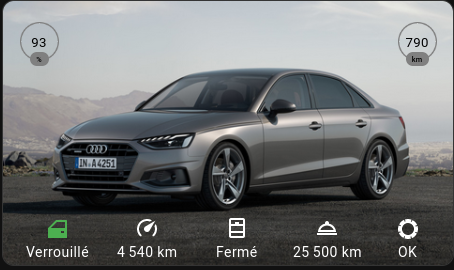

Audi Connect Integration for Home Assistant
============================================================


![Code Style][blackbadge]


Description 
------------
The `audiconnect` component provides an integration with the Audi Connect cloud service. It adds presence detection, sensors such as range, mileage, and fuel level, and provides car actions such as locking/unlocking and setting the pre-heater.

**Note:** Certain functions require special permissions from Audi, such as position update via GPS. 

Credit for initial API discovery go to the guys at the ioBroker VW-Connect forum, who were able to figure out how the API and the PIN hashing works. Also some implementation credit to davidgiga1993 of the original [AudiAPI](https://github.com/davidgiga1993/AudiAPI) Python package, on which some of this code is loosely based.
Thank you at arjenvrh who knew how to maintain and evolve the code for many years

Installation
------------

Installation can be done manually by copying the files in this repository into the `custom_components` directory in the Home Assistant configuration directory:
1. Open the configuration directory of your Home Assistant installation.
2. If you do not have a `custom_components` directory, create it.
3. In the `custom_components` directory, create a new directory called `audiconnect`.
4. Copy all files from the `custom_components/audiconnect/` directory in this repository into the `audiconnect` directory.
5. Restart Home Assistant.
6. Add the integration to Home Assistant (see **Configuration**).

Configuration
-------------

Configuration is done through the Home Assistant UI.

[](https://my.home-assistant.io/redirect/config_flow_start/?domain=audiconnect)

### Configuration Variables

**username**

- (string)(Required) The username associated with your Audi Connect account.

**password**

- (string)(Required) The password for your Audi Connect account.

**S-PIN**

- (string)(Optional) The S-PIN for your Audi Connect account.

**region**

- (selector)(Required) The region where your Audi Connect account is registered. 

Services
--------

**audiconnect.refresh_vehicle_data**

Normal updates retrieve data from the Audi Connect service, and don't interact directly with the vehicle. _This_ service triggers an update request from the vehicle itself. When data is retrieved successfully, Home Assistant is automatically updated. The service requires a vehicle identification number (VIN) as a parameter. 

**audiconnect.execute_vehicle_action**

Perform an action on the vehicle. The service takes a VIN and the action to perform as parameters. Possible action values:
- lock
- unlock 
- start_climatisation
- stop_climatisation
- start_charger
- start_timed_charger
- stop_charger
- start_preheater
- stop_preheater
- start_window_heating
- stop_window_heating 

**Note:** Certain action require the S-PIN to be set in the configuration. 

When an action is successfully performed, an update request is automatically triggered. 

Example Dashboard Card
----------------------

Below is an example Dashboard (Lovelace) card illustrating some of the sensors this Home Assistant addon provides. 



The card requires the following front end mods:
- https://github.com/thomasloven/lovelace-card-mod
- https://github.com/custom-cards/circle-sensor-card

These mods can (like this integration) be installed using HACS.

The card uses the following code in `ui-lovelace.yaml` (or wherever your Dashboard is configured).

```yaml
     - type: picture-elements
        image: /local/pictures/audi_sq7.jpeg
        style: | 
          ha-card {
            border-radius: 10px;
            border: solid 1px rgba(100,100,100,0.3);
            box-shadow: 3px 3px rgba(0,0,0,0.4);
            overflow: hidden;
          } 
        elements:
        - type: image
          image: /local/pictures/cardbackK.png
          style:
            left: 50%
            top: 90%
            width: 100%
            height: 60px

        - type: icon
          icon: mdi:car-door
          entity: sensor.doors_trunk_sq7
          tap_action: more_info
          style: {color: white, left: 10%, top: 86%}
        - type: state-label
          entity: sensor.doors_trunk_sq7
          style: {color: white, left: 10%, top: 95%}

        - type: state-icon
          entity: sensor.windows_sq7
          tap_action: more_info
          style: {color: white, left: 30%, top: 86%}
        - type: state-label
          entity: sensor.windows_sq7
          style: {color: white, left: 30%, top: 95%}

        - type: icon
          icon: mdi:oil
          entity: sensor.audi_sq7_oil_level
          tap_action: more_info
          style: {color: white, left: 50%, top: 86%}
        - type: state-label
          entity: sensor.audi_sq7_oil_level
          style: {color: white, left: 50%, top: 95%}

        - type: icon
          icon: mdi:room-service-outline
          entity: sensor.audi_sq7_service_inspection_time
          tap_action: more_info
          style: {color: white, left: 70%, top: 86%}
        - type: state-label
          entity: sensor.audi_sq7_service_inspection_time
          style: {color: white, left: 70%, top: 95%}

        - type: icon
          icon: mdi:speedometer
          entity: sensor.audi_sq7_mileage
          tap_action: more_info
          style: {color: white, left: 90%, top: 86%}
        - type: state-label
          entity: sensor.audi_sq7_mileage
          style: {color: white, left: 90%, top: 95%}

        - type: custom:circle-sensor-card
          entity: sensor.audi_sq7_tank_level
          max: 100
          min: 0
          stroke_width: 15
          gradient: true
          fill: '#aaaaaabb'
          name: tank
          units: ' '
          font_style:
            font-size: 1.0em
            font-color: white
            text-shadow: '1px 1px black'
          style:
            top: 5%
            left: 80%
            width: 4em
            height: 4em
            transform: none

        - type: custom:circle-sensor-card
          entity: sensor.audi_sq7_range
          max: 630
          min: 0
          stroke_width: 15
          gradient: true
          fill: '#aaaaaabb'
          name: range
          units: ' '
          font_style:
            font-size: 1.0em
            font-color: white
            text-shadow: '1px 1px black'
          style:
            top: 5%
            left: 5%
            width: 4em
            height: 4em
            transform: none
```

[blackbadge]: https://img.shields.io/badge/code%20style-black-000000.svg?style=flat

